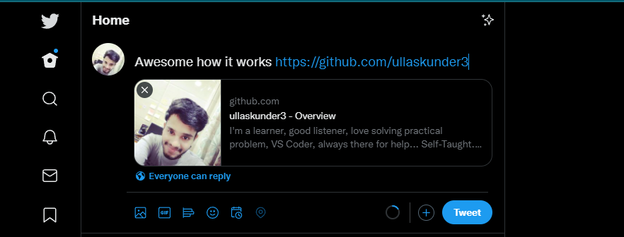
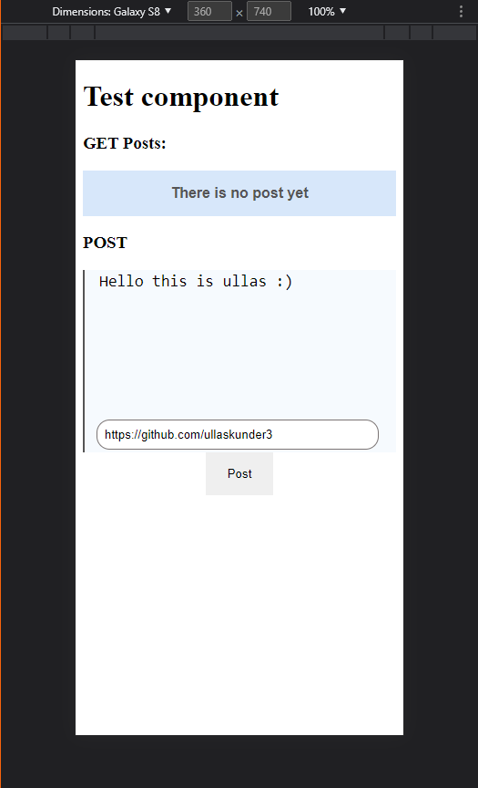
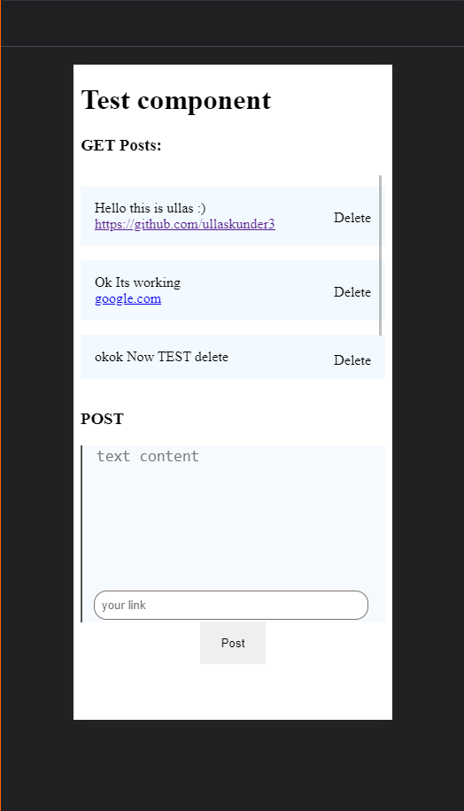

# Testing an idea with api, ui & db

motive:

I was curious how those `URL preview` work in most of the social networking site
like in twitter

I was not able to achive exactly not even close but `working on it`

|    Algo                           | Time(Best)                        |
|:---------------------------------:|-----------------------------------|
|  |  |
